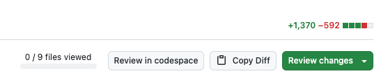

# GitHub PR Diff to Markdown

A Chrome extension that adds a "Copy Diff" button to GitHub Pull Requests, allowing you to instantly copy the PR diff in markdown format - perfect for AI code reviews and documentation.


## 🚀 Features

- **One-Click Copy**: Adds a seamless "Copy Diff" button next to the "Review changes" button on GitHub PRs
- **AI-Ready Format**: Exports diffs in markdown format, optimized for AI code review tools like ChatGPT, Claude, or Copilot
- **Customizable Prompts**: Configure your own system prompt to guide AI reviews (e.g., focus on security, performance, or specific coding standards)
- **Smart Integration**: Automatically fetches PR metadata (title, repository, PR number) along with the diff
- **No API Keys Required**: Works directly with GitHub's interface - no authentication needed

## 📦 Installation

### From Chrome Web Store (Recommended)
*Coming soon!*

### Manual Installation (Developer Mode)

1. **Download the extension**
   ```bash
   git clone https://github.com/jordanmiguel/get-pr-diff.git
   cd get-pr-diff
   ```

2. **Generate icon files**
   - Open `create-icons.html` in your browser
   - The icons will be automatically downloaded
   - Move the downloaded PNG files to the `icons/` folder

3. **Install in Chrome**
   - Open Chrome and go to `chrome://extensions/`
   - Enable "Developer mode" (toggle in top right)
   - Click "Load unpacked"
   - Select the `get-pr-diff` folder

## 🎯 Usage

1. **Navigate to any GitHub Pull Request**
2. **Click on the "Files changed" tab**
3. **Find the "Copy Diff" button** (appears left of "Review changes")
4. **Click to copy** - The entire PR diff is now in your clipboard in markdown format
5. **Paste into your favorite AI tool** for instant code review



## ⚙️ Configuration

### Customizing the AI Prompt

1. Click the extension icon in your Chrome toolbar
2. Edit the default prompt to match your review needs
3. Click "Save Settings"

**Default prompt includes:**
- Focus areas: bugs, security, performance, code quality
- Response format with file-specific feedback
- Guidelines for constructive reviews

### Example Custom Prompts

**Security-Focused:**
```markdown
You're a security expert reviewing code for vulnerabilities.
Focus on: SQL injection, XSS, authentication issues, data exposure...
```

**Performance Review:**
```markdown
Analyze this PR for performance implications.
Look for: N+1 queries, unnecessary loops, memory leaks...
```

## 📋 Output Format

The extension copies PR information in this structure:

```markdown
[Your configured system prompt]

# Pull Request: [PR Title]

**Repository:** owner/repo  
**PR Number:** #123  
**URL:** https://github.com/owner/repo/pull/123

## Diff

```diff
[Full PR diff with + and - indicators]
```

## 🛠️ Technical Details

### Architecture

- **Content Script**: Injects the button and handles diff fetching
- **Background Script**: Manages CORS-free network requests
- **Popup**: Settings interface for prompt customization
- **Storage**: Chrome sync storage for settings persistence

### Permissions

- `activeTab`: Access to current GitHub tab
- `clipboardWrite`: Copy formatted diff to clipboard
- `storage`: Save user preferences
- Host permissions for `github.com` and `patch-diff.githubusercontent.com`

## 🤝 Contributing

Contributions are welcome! Please feel free to submit a Pull Request. For major changes, please open an issue first to discuss what you would like to change.

1. Fork the repository
2. Create your feature branch (`git checkout -b feature/AmazingFeature`)
3. Commit your changes (`git commit -m 'Add some AmazingFeature'`)
4. Push to the branch (`git push origin feature/AmazingFeature`)
5. Open a Pull Request

## 🐛 Known Issues

- The button only appears on the "Files changed" tab
- Large diffs (>10MB) may take a moment to copy
- Some GitHub Enterprise instances may require additional configuration

## 📄 License

This project is licensed under the MIT License - see the [LICENSE](LICENSE) file for details.

## 🙏 Acknowledgments

- Inspired by the need for better AI-assisted code reviews
- Built for developers who love efficient workflows
- Special thanks to all contributors and users

## 📞 Support

- **Issues**: [GitHub Issues](https://github.com/jordanmiguel/get-pr-diff/issues)
- **Discussions**: [GitHub Discussions](https://github.com/jordanmiguel/get-pr-diff/discussions)

---

**Made with ❤️ for developers who value their time**